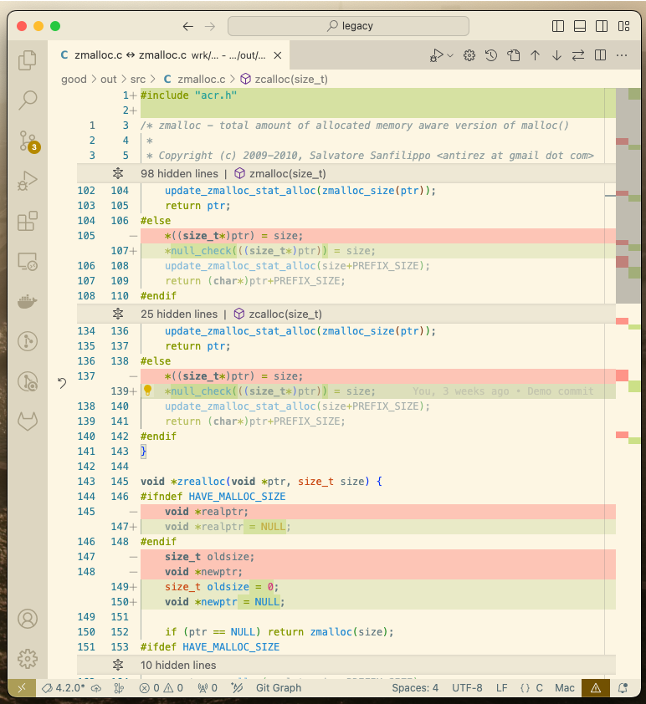

# Redemption project

This is the Redemption of False Positives project.

## Copyright

<legal>
'Redemption' Automated Code Repair Tool
Copyright 2023, 2024 Carnegie Mellon University.
NO WARRANTY. THIS CARNEGIE MELLON UNIVERSITY AND SOFTWARE ENGINEERING
INSTITUTE MATERIAL IS FURNISHED ON AN 'AS-IS' BASIS. CARNEGIE MELLON
UNIVERSITY MAKES NO WARRANTIES OF ANY KIND, EITHER EXPRESSED OR IMPLIED,
AS TO ANY MATTER INCLUDING, BUT NOT LIMITED TO, WARRANTY OF FITNESS FOR
PURPOSE OR MERCHANTABILITY, EXCLUSIVITY, OR RESULTS OBTAINED FROM USE OF
THE MATERIAL. CARNEGIE MELLON UNIVERSITY DOES NOT MAKE ANY WARRANTY OF ANY
KIND WITH RESPECT TO FREEDOM FROM PATENT, TRADEMARK, OR COPYRIGHT
INFRINGEMENT.
Licensed under a MIT (SEI)-style license, please see License.txt or
contact permission@sei.cmu.edu for full terms.
[DISTRIBUTION STATEMENT A] This material has been approved for public
release and unlimited distribution.  Please see Copyright notice for
non-US Government use and distribution.
This Software includes and/or makes use of Third-Party Software each
subject to its own license.
DM23-2165
</legal>

<a name="build-instructions"></a>
## Capabilities

The Redemption tool makes repairs to C/C++ source code based on alerts produced by certain static-analysis tools.  Here is a screenshot of some repairs that the Redemption tool suggests:



For more details of the background and capabilities of the Redemption tool, see this [presentation](https://www.sei.cmu.edu/publications/annual-reviews/2023-research-review/research-review-article.cfm?customel_datapageid_326381=495820) from the [SEI Research Review 2023](https://www.sei.cmu.edu/publications/annual-reviews/2023-research-review/).

<a name="static-analysis-tools"></a>
### Static-Analysis Tools

Redemption is currently able to identify alerts from the following static-analysis tools:

| Tool         | Version | License      | Dockerfile              | Original Container                               | Origin            | Instructions      |
|--------------|---------|--------------|-------------------------|--------------------------------------------------|-------------------|-------------------|
| Clang-tidy   |  16.0.6 | LLVM Release | Dockeffile.prereq       | silkeh/clang:latest                              | [Clang-tidy](https://clang.llvm.org/extra/clang-tidy)   | [Clang-tidy](data/clang-tidy/Clang-tidy.md)   |
| Cppcheck     |   2.4.1 | GPL v3       | Dockerfile.codechecker  | facthunder/cppcheck:latest                       | [Cppcheck](https://cppcheck.sourceforge.io)     | [Cppcheck](data/cppcheck/Cppcheck.md)     |
| Rosecheckers |         | CMU (OSS)    | Dockerfile.rosecheckers | ghcr.io/cmu-sei/cert-rosecheckers/rosebud:latest | [Rosecheckers](https://github.com/cmu-sei/cert-rosecheckers) | [Rosecheckers](data/rosecheckers/CERT-Rosecheckers.md) |

For each tool, you can use the appropriate `Dockerfile` to create a container. For example, to run Cppcheck, you can build the `codechecker` container which will contain it:

```sh
docker  build -f Dockerfile.codechecker  -t ghcr.io/cmu-sei/redemption-codechecker  .
```

Rather than build the container, you could pull the `Original Container` as in:

```sh
docker run -it --rm facthunder/cppcheck:latest /bin/bash
```

Note that clang-tidy is part of the `prereq` Redemption container, so it is already installed in the same container as Redemption.

You may run other tools, or create alerts manually; however Redemption has not been tested with alerts produced by other tools.

<a name="alert-categories"></a>
### Alert Categories

Redemption can currently repair the following categories of alerts. These alerts will often have a [MITRE CWE](https://cwe.mitre.org/) number associated with them, or a rule in the [SEI CERT C Coding Standard](https://wiki.sei.cmu.edu/confluence/display/c/SEI+CERT+C+Coding+Standard).

| Category                 | CERT Rule ID | CWE ID |
|--------------------------|--------------|--------|
| Null Pointer Dereference | EXP34-C      | 476    |
| Uninitialized Value Read | EXP33-C      | 908    |
| Ineffective Code         | MSC12-C      | 561    |

We hope to add more categories soon.

The repairs we make are very simple:

For a null pointer dereference, we use a `null_check()` macro to protect any pointer that might be null. That is, we replace any expression `x` that might represent a null pointer, with the value `null_check(x)`. This macro is defined in [acr.h](code/acr/acr.h). and it effectively invokes error-handling code if `x` is null. Here `x` can be any expression; it need not be a pointer variable.  By default, the error-handling code aborts the program (via `abort()`), but you can override it to have more specific behaviors, such as `return NULL`, if you are inside a function that returns NULL on an error.

For an uninitialized value read, we simply go to the variable's declaration, and set it to 0 (or the equivalent of 0 for the variable's type...it could be 0.0 for floats for example).

For ineffective code, the simplest solution is to remove the portion of the statement or expression that is ineffective. For example, evaluating some expression, and assigning the result to a variable that is never read, such as:

    x = foo(...);

can be repaired by preserving the expression and removing the assignment.

    (void) foo(...);

(Casting a function's return value to `(void)` is a common indication that the function's return value is to be ignored. See [Exception 1 of CERT rule EXP12-C](https://wiki.sei.cmu.edu/confluence/x/mtYxBQ) for more information.

Note that this code is ineffective only if the assignment can be proved not to invoke a C++ constructor, destructor, overloaded assignment operator or overloaded conversion or cast operators, which might have side effects.

Also note that Ineffective Code (MSC12-C) is a recommendation not a rule, and this presented additional complications, including the `REPAIR_MSC12` environment variable that we currently use.  For more information, see the [Ineffective Code](doc/dead_code.md) document, and the [Environment Variables](#environment-variables) section of this document.

## Build instructions

The code is designed to run inside a Docker container, which means you will need [Docker](https://www.docker.com/). In particular, once you can run containers, you will need to share filesystems between your host and the various containers. For that you want the `-v` switch in your `docker run` command, its documentation is available here:

https://docs.docker.com/reference/cli/docker/container/run/#volume


We provide three useful containers for working with Redemption.

### `prereq` Image

This image contains all the dependencies needed to run the repair tool, but it does not actually contain the repair tool itself. This container is useful if you wish to debug or extend the tool itself, as you can edit Redemption files on your host and immediately access them in the container.

To build this Docker container:

```sh
docker  build -f Dockerfile.prereq   -t ghcr.io/cmu-sei/redemption-prereq   .
```

This command starts a Bash shell in the container: (Note that to run Redemption, you must make your Redemption folder available to the container...if you omit the `-v` argument and its value, the container cannot access or run the repair code.)

```sh
docker run -it --rm  -v ${PWD}:/host -w /host  ghcr.io/cmu-sei/redemption-prereq  bash
```

### `distrib` Image

This image is just like the `prereq` image, but it also contains the Redemption code.  We recommend using this container if you wish to run Redemption without modifying or extending it.

The build command is:

```sh
docker  build -f Dockerfile.distrib  -t ghcr.io/cmu-sei/redemption-distrib  .
```

And the run command is:

```sh
docker run -it --rm  ghcr.io/cmu-sei/redemption-distrib  bash
```

Unlike the `distrib` container, the `prereq` container does not contain the Redemption code; it just contains dependencies necessary to run Redemption. But the Redemption code lives outside the container, on a shared volume.  This allows you to modify the Redemption code on the host, while accessing it within the container.

### `test` Image

There is a `test` Docker image that you can use to extensively test Redemption. It downloads and builds the `git` and `zeek` OSS projects. Building zeek takes about 40 minutes on one machine.  Like the `prereq` image, the `test` image does not actually contain the Redemption code, so you will need to explicitly share the Redemption volume when you launch the container. To build and run the `test` container:  

```sh
docker  build  -f Dockerfile.test  -t ghcr.io/cmu-sei/redemption-test  .
docker run -it --rm  -v ${PWD}:/host -w /host  ghcr.io/cmu-sei/redemption-test  bash
```

<a name="simple-sanity-test"></a>
### Simple Sanity Test

The tool has a simple sanity test that you can run in the `distrib` container. It uses `pytest` to run all the tests in the `/host/code/acr/test` directory of the container (all in functions with names starting with `test_`)  After launching the `distrib` container, the following commands will run a few sanity tests:

```sh
pushd /host/code/acr/test
pytest
```

All tests should pass.

### Mounting other volumes

As with any Docker containers, you may share other folders with the Redemption container by mounting other volumes.  We recommend mounting a volume that contains the code you wish to repair. For example if your codebase to repair lives in `/opt/code`, you can mount it in any container:

```sh
docker run -it --rm  -v ${PWD}:/host -w /host  -v /opt/code:/codebase  ghcr.io/cmu-sei/redemption-prereq  bash
docker run -it --rm  -v /opt/code:/codebase  ghcr.io/cmu-sei/redemption-distrib  bash
```

Many codebases are configured to build in a particular location. If your code will not build properly unless it lives in a directory like `/opt/codebase`, then you should mount it in the container in the same directory:

```sh
docker run -it --rm  -v ${PWD}:/host -w /host  -v /opt/code:/opt/code  ghcr.io/cmu-sei/redemption-prereq  bash
docker run -it --rm  -v /opt/code:/opt/code  ghcr.io/cmu-sei/redemption-distrib  bash
```

## Demos

In the `doc/examples` directory, there are several demos, each living in its own directory. The following table lists each demo; its title is the same as the folder containing the demo. The demos differ in the properties of the code they repair, and this is reflected in the `Codebase` column:

| Demo Title       | Codebase                                          |
|------------------|---------------------------------------------------|
| `simple`         | Simple C source file                              |
| `codebase`       | Multi-file OSS codebase                           |
| `separate_build` | OSS codebase requiring separate build environment |

If you are new to the Redemption tool, we recommend going through at least one of these demos.  If you wish to repair a single C file, you should study the `simple` demo. If you wish to repair a multi-file codebase, and you can build the codebase in the Redemption container, you should study the `codebase` demo. If your code does not build in the Redemption container, you should study the `separate_build` demo.

<a name="running-the-redemption-tool"></a>
## Running the Redemption Tool

<a name="background"></a>
### Background

Inputs to the Redemption tool include:

* [Codebase](#volume-sharing-and-docker-run):  This is a path to one or more C/C++ source code files. For multiple source files, the `compile_commands.json` file (from `bear`, discussed more [below](#example-execution-to-repair-a-codebase)) identifies the path for each file, while the `-b` or `--base-dir` argument to `sup.py` (discussed more [below](#detail-about-the-suppy-script)) specifies the base directory of the project).
* [Build command](#compile-commands):  This can be a compile command or a build system like "make".  Redemption needs this in order to learn which macros are defined and what switches are necessary to let Clang parse a source code file).
Each alert contains a CERT coding rule or CWE ID, location, message and more - see [doc/alert_data_format.md](doc/alert_data_format.md).
* [SA tool alerts file](#static-analysis):  The Redemption tool produces outputs (for each SA alert from input, either a patch to repair the alert OR explanation in text why it cannot be repaired).

The command line tool takes the inputs listed above. The command-line tool's `ear` module creates an enhanced abstract syntax tree (AST), its [`brain` module](doc/brain_architecture.md) augments information about each alert and creates a more-enhanced AST and applies alerts and patches, and its `glove` module produces repaired source code. Depending on arguments provided to the [end-to-end script](#detail-about-the-end_to_end_acrpy-script) or [superscript](#detail-about-the-suppy-script) (discussed below), some or all of the steps are done and the way that is done can be specified per the arguments.

The `base_dir` sets the base directory of the project being analyzed. When repairing a whole codebase, the `base_dir` is the directory where the source code to be repaired is located. (When repairing a single file, specifying the `base_dir` is not necessary.) 

Our tool has three top-level Python scripts:

* `end_to_end_acr.py`: Runs on a single translation unit (a single `.c` or `.cpp` file, perhaps also repairing `#include`-ed header files)
* `sup.py`: Runs on all the C/C++ source files in a whole codebase (That is, it runs on a whole project, with all translation units specified in a `compile_commands.json` file generated by the `bear` OSS tool.)
* `make_run_clang.py`: Runs on a single translation unit or all the files in a codebase. Produces a shell script containing Clang commands that Redemption would need to repair it. See the [Codebases that cannot be built within the Redemption container](#codebases-that-cannot-be-built-within-the-redemption-container) section for more information.

<a name="detail-about-the-end_to_end_acrpy-script"></a>
#### Detail about the `end_to_end_acr.py` script

This script runs automated code repair or parts of it, depending on the arguments specified.

Since the script and its arguments are subject to change, the best way to identify the current arguments and way to run it involves running the script with no arguments or with `--help` as an argument. E.g., in a bash terminal, in the directory `code/acr`, run:

`./end_to_end_acr.py --help`

The `STEP_DIR` is a directory the tool uses to put intermediate files of the steps of the process, including output from `brain` with enhanced AST and enhanced alerts, plus repairs that may be applied. This information is useful for understanding more about a particular repair, for instance if the repair result is not as you expected. The `*.nulldom.json` intermediate files are stored there even if environment variable `pytest_keep` is set to `false`. Output of other individual modules (ear, brain, etc.) are stored in `STEP_DIR` only if environment variable `pytest_keep` is set to `true`.

<a name="detail-about-the-suppy-script"></a>
#### Detail about the `sup.py` script

This script runs automated code repair or parts of it, depending on the arguments specified.

Since the script and its arguments are subject to change, the best way to identify the current arguments and way to run it involves running the script with no arguments or with `--help` as an argument. E.g., in a bash terminal, in the directory `code/acr`, run:

`./sup.py --help`

As specified [above](#detail-about-the-end_to_end_acrpy-script), the `STEP_DIR` is a directory the tool uses to put intermediate files of the steps of the process, including output from `brain` with enhanced AST and enhanced alerts, plus repairs that may be applied. This information is useful for understanding more about a particular repair, for instance if the repair result is not as you expected. The `*.nulldom.json` intermediate files are stored there even if environment variable `pytest_keep` is set to `false`. Output of other individual modules (ear, brain, etc.) are stored in `STEP_DIR` only if environment variable `pytest_keep` is set to `true`.

<a name="environment-variables"></a>
#### Environment variables

```bash
export acr_default_lang_std=foo # Adds "--std=foo" to the beginning of the arguments given to Clang.
export acr_emit_invocation=true # Show subprogram invocation information
export acr_gzip_ear_out=false   # Whether to compress the AST (the output of the ear module); true by default.
export acr_ignore_ast_id=true   # Tests pass even if AST IDs are different
export acr_parser_cache=/host/code/acr/test/cache/  # Cache the output of the ear module, else set to ""
export acr_parser_cache_verbose=true # Print messages about the cache, for debugging/troubleshooting
export acr_show_progress=true   # Show progress and timing
export acr_skip_dom=false       # Skip dominator analysis
export acr_warn_unlocated_alerts=true  # Warn when alerts cannot be located in AST
export pytest_keep=true         # Keep output of individual modules (ear, brain, etc.). Regardless, the *.nulldom.json intermediate file is kept.
export pytest_no_catch=true     # Break into debugger with "-m pdb" instead of catching exception
export REPAIR_MSC12=true        # Repair MSC12-C alerts (By default, the system DOES do the repair. The system does not do this repair if this variable is set to `false`)
```


<a name="static-analysis"></a>
### Static Analysis

The Redemption Tool presumes that you have static-analysis (SA) tool output.  It currently supports three SA tools:  `clang_tidy` or `cppcheck` or `rosecheckers`. Each SA tool should produce a file with the alerts it generated. If `$TOOL` represents your tool, instructions for generating the alerts file live in `data/$TOOL/$TOOL.md`.  We will assume you have run the tool, and created the alerts file, which we will call `alerts.txt`. (The actual file need not be a text file).  Finally, when you produced your SA output, the code you ran was in a directory which we'll call the `$BASE_DIR`.

<a name="convert-static-analysis-output-to-redemption-tool-input-alerts"></a>
### Convert Static Analysis Output to Redemption Tool Input Alerts

Next, you must convert the `alerts.txt` format into a simple JSON format that the redemption tool understands. The `alerts2input.py` file produces suitable JSON files. So you must run this script first; it will create the `alerts.json` file with the alerts you will use.

``` sh
python3 /host/code/analysis/alerts2input.py  $BASE_DIR  clang_tidy  alerts.txt  alerts.json
```

For example, the `test` Docker container contains the source code for Git, as well as Cppcheck output.  So you can convert Cppcheck's output to alerts using this script:

``` sh
python3 /host/code/analysis/alerts2input.py  /oss/git  cppcheck  /host/data/cppcheck/git/cppcheck.xml  ./alerts.json
```

<a name="manually-generated-input"></a>
### Manually-generated Input

The `alerts.json` file is a straightforward JSON file, and one can be created manually. This file consists of a list of alerts, each list element describes one alert. Each alert is a map with the following keys:

 * `tool`: The static-analysis tool reporting the alert
 * `file`: The source file to repair. May be a header (`.h`) file
 * `line`: Line number reported by tool
 * `column`: (Optional) Column number reported by tool
 * `message`: String message reported by tool
 * `checker`: The checker (that is, component of the SA tool) that reported the alert
 * `rule`: The CERT rule or CWE that the alert indicates (alert about a rule being violated or a weakness instance in the code)

The file, line, and rule fields are the only strictly required fields. However, the column and message fields are helpful if the file and line are not sufficient to identify precisely which code is being reported. Be warned that due to inconsistencies between the way different SA tools report alerts, our tool may misinterpret a manually-generated alert. The best way to ensure your alert is interpreted correctly is to fashion it to be as similar as possible to an alert generated by clang_tidy or cppcheck.

See the [Alert Data Format](doc/alert_data_format.md) document for more details about fields that may be used when describing alerts.

<a name="compile-commands"></a>
### Compile Commands

Next, you must indicate the compile commands that are used to build your project. The `bear` command can be used to do this; it takes your build command and builds the project, recording the compile commands in a local `compile_commands.json` file.

The following command, when run in the `test` container, creates the `compile_commands.json` file for git. (Note that this file already exists in the container, running this command would overwrite the file.)

``` sh
cd /oss/git
bear -- make
```

<a name="volume-sharing-and-docker-run"></a>
### Volume-sharing and `docker run`

To enable the Redemption container to run repairs on your local code directories, you should volume-share them with `-v` when you launch the container.  For example, to volume-share a local directory `./code`:

`docker run -it --rm -v ./code:/myCode ghcr.io/cmu-sei/redemption-distrib  bash`

See https://docs.docker.com/storage/volumes/ for more information on volume-sharing.
See https://docs.docker.com/reference/cli/docker/container/run/ for more information about options using the `docker run` command.

<a name="execution"></a>
### Execution
<a name="example-execution-to-repair-a-single-file"></a>
#### Example Execution to Repair a Single File

Here is an example of how to run a built-in end-to-end automated code repair test, within the container (you can change the `out` directory location or directory name, but you must create that directory before running the command):

```sh
pushd /host/code/acr
python3 ./end_to_end_acr.py  /oss/git/config.c  /host/data/compile_commands.git.json  \
    --alerts /host/data/test/sample.alerts.json  --repaired-src test/out  \
    --base-dir /oss/git  --repair-includes true
```

You can see the repairs made using this command:

```sh
diff -u /oss/git/hash.h /host/code/acr/test/out/hash.h
```


To test a single C file that needs no fancy compile commands, you can use the `autogen` keyword instead of a `compile_commands.json` file:

```sh
pushd /host/code/acr
python3 ./end_to_end_acr.py  test/test_errors.c  autogen \
    --alerts test/test_errors.alerts.json  \
    --base-dir test  --repaired-src test/out
```

<a name="example-execution-to-repair-a-codebase"></a>
#### Example Execution to Repair a Codebase

You may need to share a volume, as discussed [above](#volume-sharing-and-docker-run).

Our tool requires that you have a single command to build the entire codebase. (There are some exceptions involving single files and `autogen`, as mentioned [above](#example-execution-to-repair-a-single-file).) This command could be a call to `clang` or some other compiler. It could be a build command like `make` or `ninja`. It could even be a shell script. To be precise, this can be any command that can be passed to `bear`, a tool for generating a compilation database for `clang` tooling.  For more info on `bear`, see: https://github.com/rizsotto/Bear ).

Run `bear` on the single-command build system (e.g., run `bear` on the makefile). Then, run the superscript `code/acr/sup.py`, giving it the `compile_commands.json` file created by `bear` and specifying code, alerts, etc. as discussed in the [above section on `sup.py`](#detail-about-the-suppy-script).

<a name="codebases-that-cannot-be-built-within-the-redemption-container"></a>
### Codebases that cannot be built within the Redemption container

Normally, Clang is invoked from within the Redemption tool.  For codebases that cannot be built within the Redemption container, we also provide an alternative method: The Redemption tool can be split into three phases:  The first phase is managed by the `make_run_clang.py` program, which generates a shell script that uses Clang to generate syntactic data about the code.  In the second phase, you then run this script on the platform where your code can be built.  After running the script, you can run the ACR process in the final phase to use the files generated by Clang to repair the code.

This does presume that your platform that builds the code can run Clang with Redemption's patch. It can also run `bear` and that you can produce static-analysis alerts for the code (independently of running Redemption).

See the [Separate_Build Instructions](doc/examples/separate_build/README.md) for an example of repairing such a codebase.

#### Example running everything within a single container:

This is a short example that demonstrates the command-line arguments used for running Clang separately:  The call of `make_run_clang.py` produces a shell script that runs Clang to generate the data necessary for Redemption to repair the source code. The call to `end_to_end_acr.py` does the actual repair, using the data generated by Clang.

```bash
mkdir -p /host/code/acr/test/cache
cd /host/code/acr
./make_run_clang.py  -c autogen  -s test/macros_near_null_checks.c  \
    --output-clang-script test/cache/run_clang.sh
bash test/cache/run_clang.sh test/cache
./end_to_end_acr.py  --repaired-src test/out  test/macros_near_null_checks.c  autogen  \
    --alerts test/macros_near_null_checks.alerts.json  --raw-ast-dir test/cache
```

#### Example running Clang outside the Redemption container:

1. On the host (i.e., outside the Redemption docker container): Run bear to generate `compile_commands.json`.

2. Mount the codebase in the Redemption container so that the base directory in the container is the same as it is in the host.  (Making a symbolic link (`ln -s`) instead of directly mounting in the right place probably won't work, because `os.path.realpath` resolves symlinks.)  Then, inside the Redemption container:

```bash
mkdir -p /host/code/acr/test/cache
cd /host/code/acr
./make_run_clang.py  -c autogen  -s test/macros_near_null_checks.c  \
    --output-clang-script test/cache/run_clang.sh
```

3. Copy `test/cache/run_clang.sh` to the host and run:

```bash
ast_out_dir=/tmp/ast_out
mkdir -p $ast_out_dir
bash run_clang.sh $ast_out_dir
cd $ast_out_dir
tar czf raw_ast_files.tar.gz *
```

4. Copy `raw_ast_files.tar.gz` to the Redemption container and then:

```bash
cd /host/code/acr/test/cache
tar xf raw_ast_files.tar.gz
cd /host/code/acr
./end_to_end_acr.py  --repaired-src test/out  test/macros_near_null_checks.c  autogen  \
    --alerts test/macros_near_null_checks.alerts.json  --raw-ast-dir test/cache
```

### Parallelization

Redemption currently uses a single processor to do its work. However, the `sup.py` script supports parallelization.  Passing it `-j <NUM>` or `--threads <NUM>` will cause it to distribute its tasks among `<NUM>` processors. If `<NUM>` is 0, then it uses all of the processors available on the platform.

See the [Codebase Demo Instructions](doc/examples/codebase/README.md) for an example of using parallelization to quickly repair a codebase

## Extending the Redemption Tool

Documentation detail about useful environment variables and further testing is in [doc/regression_tests.md](doc/regression_tests.md). Also, a lot more detail about our system that may be of interest to others interested in extending it or just understanding it better is in the [doc](doc) directory.

## Troubleshooting

When building a Docker container, if you get an error message such as:

    error running container: from /usr/bin/crun creating container for [/bin/sh -c apt-get update]: sd-bus call: Transport endpoint is not connected: Transport endpoint is not connected : exit status 1

then try:

```sh
unset XDG_RUNTIME_DIR
unset DBUS_SESSION_BUS_ADDRESS
```

For more information, see https://github.com/containers/buildah/issues/3887#issuecomment-1085680094

## Contributions to the Redemption Codebase are Welcome

Contributions to the Redemption codebase are welcome! If you have code repairs or other contributions, we welcome that - you could submit a pull request via GitHub, or contact us if you'd prefer a different way.
